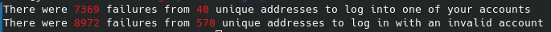

# Log Report
If you ever run a server, one thing you may notice is that opportunists will try to ssh into your machine **constantly**. In the first two days after I put up my [website](www.julianchastain.com), there were more than **7,000** attempts to try to log into it. This is a tool I put together to track that. Running `logreport` will inform you how many attempts there have been to log in with account names that are valid or invalid on your server and will tell you how many of those came from unique IP addresses.
## How to install
Because I am obsessed with one line installation scripts, the shortest way to install this is with:
`sudo sh $(curl https://github.com/JulianChastain/logReport/blob/main/install.sh)` 
If you want to install it without executing random curl results, use the following two liner:
`sudo curl https://github.com/JulianChastain/logReport/blob/main/logreport /bin/logreport`
`chmod +x /bin/logreport`
Please do not clone this repository, there are zero advantages to that.
## Usage
Just run `logreport`

## How to actually secure your server
Obviously knowing how many attempts there are to break into your server does nothing to stop them from succeeding. <abbr title="Please note I am not a security expert">In order from most important to least important you can secure your server by</abbr>:
1. [Ensuring you have a password that is practically impossible to brute force](https://www.uic.edu/apps/strong-password/)
2. [Enable logging onto your server via ssh keys **and** disable logging on via password](https://linuxize.com/post/how-to-setup-passwordless-ssh-login/)
3. [Use the Fail2ban utility to ban ip addresses that fail to log on too many times in a time window](https://www.fail2ban.org/wiki/index.php/Main_Page)
4. The most fun option: [Using endlessh on port 22](https://github.com/skeeto/endlessh) so that attackers get stalled forever when they try to log into the main port.
